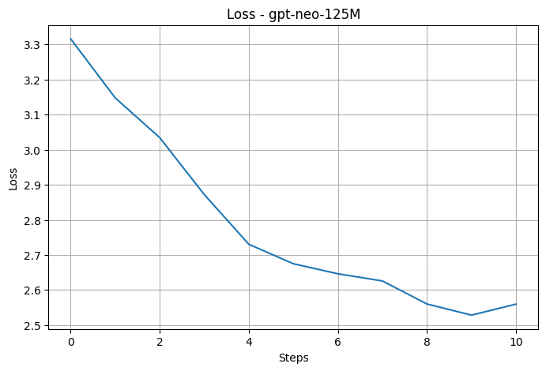
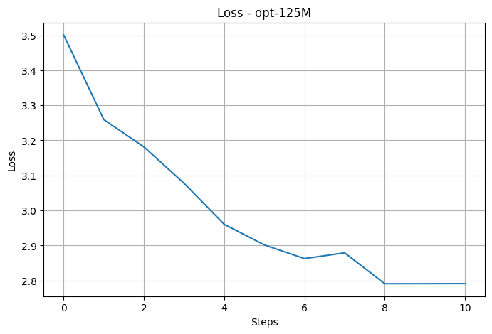
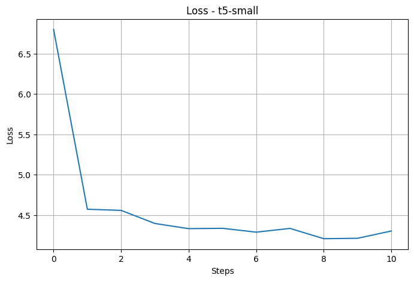
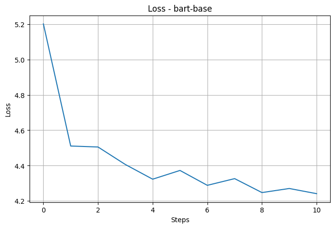
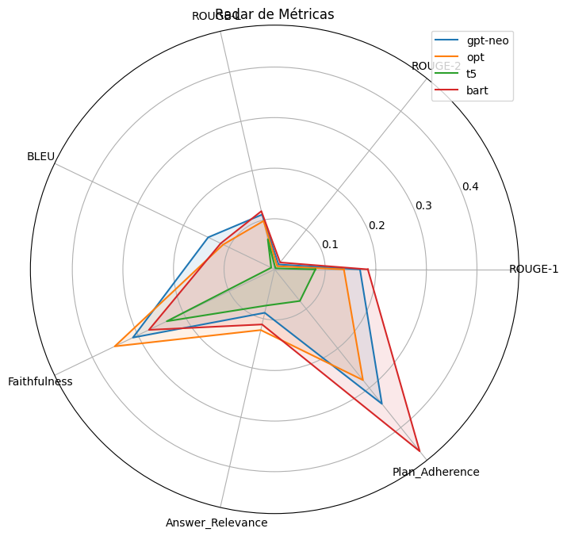

# Pipeline RAG com Fine-Tuning LoRA e Disponibilização via API RESTful

## Universidade Federal do Rio Grande do Norte (UFRN)
### Centro de Ensino Superior do Seridó (CERES)
### Departamento de Computação e Tecnologia (DCT)

**Discente:** João Vitor Ramalho Valentim  
**Docente:** Dr. Thommas K. S. Flores  
**Disciplina:** Tópicos Avançados em IA A

---

# Objetivo

Este projeto implementa um pipeline completo de Retrieval-Augmented Generation (RAG), contemplando:

- Extração de conhecimento de documentos PDF;
- Conversão e limpeza textual;
- Geração automática de dataset para Fine-Tuning;
- Curadoria manual e automática dos dados;
- Fine-Tuning utilizando LoRA (Low-Rank Adaptation);
- Avaliação quantitativa e qualitativa;
- Disponibilização dos modelos por meio de API RESTful desenvolvida com FastAPI;
- Publicação temporária utilizando Ngrok.

---

# Documento Utilizado

Livro utilizado como base de conhecimento:

**BRITO, Hérica Landi de; SOUZA, Lorrane Ribeiro de (org.).**

*Psicologia, Neurociências e Comportamento: Estudos Teóricos e Aplicados.*

Editora CRV, Curitiba, 2022.

## Livro Base

---

# Pipeline do Projeto

O desenvolvimento foi dividido em quatro etapas principais:

1. Extração e limpeza do documento;
2. Geração e curadoria do dataset;
3. Fine-Tuning LoRA;
4. Disponibilização via API RESTful.

---

# Extração e Limpeza do Texto

Durante os testes iniciais observou-se que a extração direta do PDF gerava:

- caracteres inválidos;
- símbolos corrompidos;
- problemas de codificação UTF-8;
- perda parcial de contexto.

Por esse motivo o PDF foi convertido para TXT antes da geração do dataset.

Após a conversão foram realizadas as seguintes etapas:

- remoção de caracteres inválidos;
- normalização textual;
- remoção de linhas quebradas;
- correção de espaçamento;
- eliminação de ruídos.

---

# Geração do Dataset

Após a limpeza, o texto foi dividido em chunks para geração automática dos pares pergunta/resposta.

| Chunk Size | Resultado |
|------------|------------|
| 500 caracteres | Maior foco contextual |
| 900 caracteres | Maior contexto semântico |

O valor de aproximadamente **900 caracteres** foi escolhido para a versão final.

Foram gerados aproximadamente **295 pares pergunta/resposta**.

Durante a curadoria foram removidos:

- respostas vazias;
- respostas truncadas;
- perguntas genéricas;
- pares redundantes;
- pares semanticamente incoerentes.

**Percentual removido:** aproximadamente **15%**.

---

# Fine-Tuning LoRA

Foram treinados quatro modelos.

## Modelos Causais

- GPT-Neo 125M
- OPT-125M

## Modelos Seq2Seq

- T5-Small
- BART-Base

### Hiperparâmetros

| Parâmetro | Valor |
|------------|------------|
| Rank (r) | 16 |
| lora_alpha | 32 |
| lora_dropout | 0.1 |
| Learning Rate | 2e-4 |
| Epochs | 3 |

---

# Loss dos Modelos

## GPT-Neo

## OPT-125M

## T5-Small

## BART-Base

---

# Avaliação Quantitativa

## Métricas Utilizadas

- BLEU
- ROUGE-1
- ROUGE-2
- ROUGE-L
- Faithfulness
- Answer Relevance
- Plan Adherence
- Perplexity

## Resultados

| Modelo | BLEU | ROUGE-L | Faithfulness | Answer Relevance | Plan Adherence | Perplexity |
|----------|----------|----------|----------|----------|----------|----------|
| GPT-Neo | 0.145837 | 0.111055 | 0.310956 | 0.088092 | 0.34 | 14.971578 |
| OPT-125M | 0.112942 | 0.098169 | 0.350876 | 0.123150 | 0.28 | 15.149551 |
| T5-Small | 0.007596 | 0.060957 | 0.236673 | 0.073352 | 0.08 | 3.676220 |
| BART-Base | 0.118330 | 0.117999 | 0.275822 | 0.111753 | 0.46 | 1.346749 |

---

# Radar de Métricas

---

# Avaliação Qualitativa

## Exemplo 2

### Pergunta utilizada

**"Explique detalhadamente o conteúdo sobre: Capítulo 0"**

### Referência

Trecho relacionado à apresentação institucional da obra e ao vínculo com o Centro Universitário Alves Faria (UNIALFA).

### Resposta GPT-Neo

> "Este vídeo foi desenvolv-lo em seguâncias. No sistema de controlação de cada análogo, segundo o que acreditamos, a criptomonedi- por aplicativos sistematórios são a partir de uma situação muito mais eficaz que o desenvolvimento de um sistema que seja um sistema de controlo..."

#### Análise

Apesar de produzir frases relativamente longas e bem estruturadas, o GPT-Neo frequentemente desviou completamente do conteúdo do documento, gerando informações inexistentes no texto-base.

### Resposta OPT-125M

> "[sem resposta relevante gerada]"

#### Análise

O modelo apresentou falha significativa de geração neste exemplo, evidenciando limitação durante o fine-tuning com pequeno volume de dados.

### Resposta T5-Small

> "Ou énço o os os os os aigus aisido a un ao os aos y es como aos aos aos aos aos aos aos..."

#### Análise

O T5 apresentou degradação textual acentuada neste exemplo, indicando dificuldade de convergência adequada durante o treinamento.

### Resposta BART-Base

> "Como ao desenvolvimento, a partir de uma aplicação, a contação de que a vida está como a criação e a compração do trabalho de vida..."

#### Análise

O BART manteve maior estabilidade sintática quando comparado aos demais modelos, embora ainda tenha apresentado repetições e baixa fidelidade factual.

---

## Exemplo 3

### Pergunta utilizada

**"Explique detalhadamente o conteúdo sobre: Capítulo 0"**

### Referência

Trecho relacionado à missão institucional da UNIALFA e ao papel do curso de Psicologia no desenvolvimento social e acadêmico.

### Resposta GPT-Neo

> "No conteúdo de estratégia e desenvolvimento, o nosso conteúdo é uma forma de pouco eficaz: o comentário pode ser usado para vários casos, porque o conteúdo é seguro para vários casos e aqueles que vêem..."

#### Análise

O GPT-Neo demonstrou maior capacidade de gerar texto contínuo e mais natural, porém com baixa aderência ao conteúdo específico do capítulo.

### Resposta OPT-125M

> "Explique detalhadamente o conteúdo sobre: Capí"

#### Análise

O modelo interrompeu a geração prematuramente, indicando instabilidade durante a inferência.

### Resposta T5-Small

> "Orientación: o ruito o valio que o entrar o feso del como es el eso del teo."

#### Análise

O modelo apresentou baixa inteligibilidade textual e mistura de idiomas/tokens inválidos.

### Resposta BART-Base

> "O conteúdo sobre: Capítulo 0"

#### Análise

Apesar de extremamente curta, a resposta do BART permaneceu mais estável e semanticamente menos corrompida que parte das respostas geradas pelos demais modelos.

---

# API RESTful

A API foi desenvolvida utilizando:

- FastAPI
- Uvicorn
- Ngrok

Endpoints:

- GET /health
- GET /modelos
- POST /chat

---

# Tecnologias Utilizadas

- Python
- Transformers
- PEFT
- LoRA
- Hugging Face
- FastAPI
- Uvicorn
- Ngrok
- Pandas
- NumPy
- Matplotlib
- Evaluate

---

# Conclusão

O projeto permitiu implementar todas as etapas fundamentais de um pipeline moderno de Retrieval-Augmented Generation.

Foi possível:

- gerar datasets automaticamente;
- realizar curadoria dos dados;
- treinar modelos utilizando LoRA;
- avaliar quantitativamente os resultados;
- disponibilizar modelos em ambiente web.

Os resultados mostraram que o **BART-Base** foi o modelo mais adequado para implantação final devido ao melhor equilíbrio entre fidelidade factual, estabilidade estrutural e aderência ao formato esperado das respostas.

---

# Referências

BRITO, Hérica Landi de; SOUZA, Lorrane Ribeiro de (org.). *Psicologia, Neurociências e Comportamento: estudos teóricos e aplicados*. Curitiba: Editora CRV, 2022.

OPENAI. ChatGPT. Disponível em: https://openai.com

XAI. Grok AI. Disponível em: https://x.ai